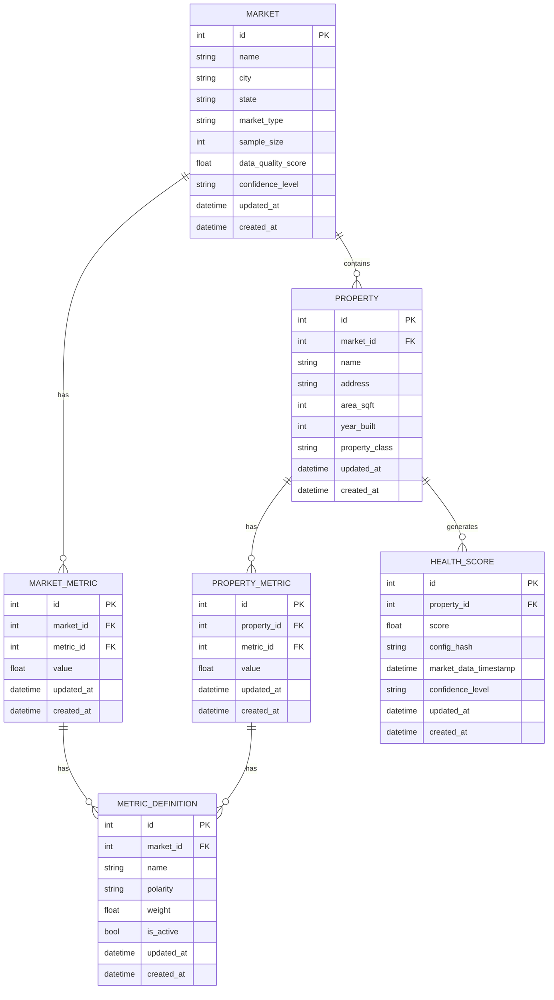

```mermaid
erDiagram

    MARKET {
        int id PK
        string name
        string city
        string state
        string market_type
        int sample_size
        float data_quality_score
        string confidence_level
        datetime updated_at
        datetime created_at
    }

    METRIC_DEFINITION {
        int id PK
        int market_id FK
        string name
        string polarity
        float weight
        bool is_active
        datetime updated_at
        datetime created_at
    }

    MARKET_METRIC {
        int id PK
        int market_id FK
        int metric_id FK
        float value
        datetime updated_at
        datetime created_at
    }

    PROPERTY_METRIC {
        int id PK
        int property_id FK
        int metric_id FK
        float value
        datetime updated_at
        datetime created_at
    }

    PROPERTY {
        int id PK
        int market_id FK
        string name
        string address
        int area_sqft
        int year_built
        string property_class
        datetime updated_at
        datetime created_at
    }

    HEALTH_SCORE {
        int id PK
        int property_id FK
        float score
        string config_hash
        datetime market_data_timestamp
        string confidence_level
        datetime updated_at
        datetime created_at
    }

    MARKET ||--o{ MARKET_METRIC : has
    MARKET_METRIC ||--o{ METRIC_DEFINITION : has
    MARKET ||--o{ PROPERTY : contains
    PROPERTY ||--o{ PROPERTY_METRIC : has
    PROPERTY_METRIC ||--o{ METRIC_DEFINITION : has
    PROPERTY ||--o{ HEALTH_SCORE : generates
```
