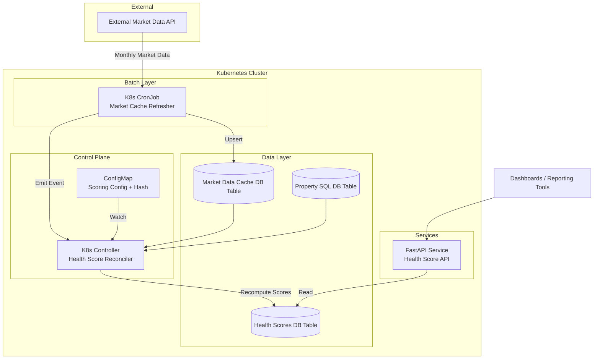

```mermaid
flowchart TB

    subgraph External
        API[External Market Data API]
    end

    subgraph Kubernetes Cluster

        subgraph Batch Layer
            Cron[K8s CronJob
            Market Cache Refresher]
        end

        subgraph Control Plane
            Controller[K8s Controller
            Health Score Reconciler]
            Config[ConfigMap
            Scoring Config + Hash]
        end

        subgraph Services
            APIService[FastAPI Service
            Health Score API]
        end

        subgraph Data Layer
            MarketCache[(Market Data Cache DB Table)]
            PropertyDB[(Property SQL DB Table)]
            HealthDB[(Health Scores DB Table)]
        end
    end

    API -->|Monthly Market Data| Cron
    Cron -->|Upsert| MarketCache
    Cron -->|Emit Event| Controller

    Config -->|Watch| Controller
    MarketCache --> Controller
    PropertyDB --> Controller
    Controller -->|Recompute Scores| HealthDB

    APIService -->|Read| HealthDB

    Users[Dashboards / Reporting Tools] --> APIService
```
